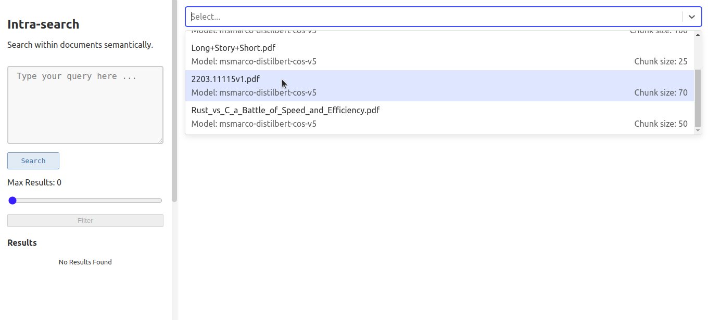
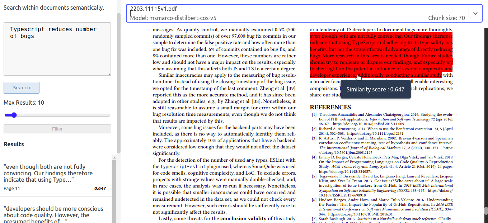

# Intra-Search

A tool for performing semantic search within documents using ***`sentence transformers`*** to find contextually relevant text.

### Features:

* ***Meaning-Based Search***: Retrieve passages of text within documents that are semantically related to your query. 
* ***Local Caching***: Embeddings are cached locally, avoiding the need for repeated processing.  
* ***Flexible Model Support***: Use pre-trained Sentence Transformer models from ``Hugging Face`` or local machine.  
* ***Interactive UI***: Web app that highlights search results and allows interactive navigation to the relevant sections of the document.  

#### Note:  
*   ***Currently supports only pdf.***

#### Requirements
    
Python >= 3.11

## Installation

#### Using `pipx` (Recommended):  
Install pipx (if not already installed)
```bash
python3 -m pip install --user pipx
python3 -m pipx ensurepath
```
Install intra-search
```bash
pipx install intra-search
```

#### Using `pip`: 
```bash
# create a new virtual environment
python3 -m venv .venv

# activate the virtual environment
source .venv/bin/activate

pip install intra-search 
```
## Usage
```
intra-search [OPTIONS] COMMAND [ARGS]...

Options:
  -d, --show-dir  Show the directory where document embeddings are cached.
  --help          Show this message and exit.

Commands:
  create  Create document embeddings
  list    List all cached embeddings
  remove  Remove embeddings
  start   Start the flask application (which serves both API and web app)
```

1. Start by creating vector embeddings for one or more documents using `create` subcommand.

    ```
    intra-search create doc1.pdf doc2.pdf doc3.pdf
    ```
    
    *Options:*
    * `-m`, `--model`: Name of the Transformer model that should be used for generating embeddings.  
     
        Any pre-trained community Sentence Transformer model (6000+ models) listed in hugging face hub can be used (eg. "sentence-transformers/all-MiniLM-L6-v2"). Checkout [SBERT](https://sbert.net/docs/sentence_transformer/pretrained_models.html#original-models) & [ All Sentence Transformer models on Hugging Face](https://huggingface.co/models?library=sentence-transformers) for a list of models that can be used.  

        To use a model from your local machine, provide the path to the model.   
        **(deafult = msmarco-distilbert-cos-v5)**


    * `-n`, `--chunks`: The number of words per chunk **(default = 50)**.

2. Launch the web application which runs on **http://localhost:5000** by default.
    ```
    intra-search start
    ```
    *Options:* 
    * `-p`, `--port`: Specify the port for the web application **(default = 5000)**. 

3. Select a document embedding for querying from the list of cached embeddings. Each option displays embedding's details such as the source document filename, the model used, and  chunk size.

    

4. Type a query into the textarea and click `search`.

    

    * Each result is associated by a ***similarity score*** ranging from ``0 to 1``, where a higher score indicates greater relevance to the search query. The results are sorted in descending order of similarity.  
    * The number of results to be shown can be adjusted using the range slider input.
    * All the texts corresponding to the search results are ***highlighted*** in the document. 
    * ***Clicking*** on a search result will scroll the document to the location of the highlighted text.

### Delete cached embeddings

```sh
# Example:
# delete all embeddings created using doc1.pdf, doc2.pdf, & doc3.pdf
intra-search remove doc1.pdf doc2.pdf doc3.pdf
```


